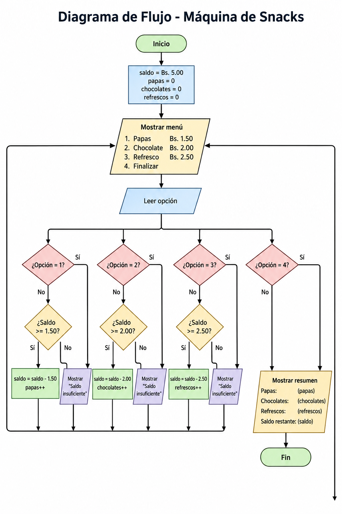

# Máquina de Snacks

## Descripción

Programa desarrollado en Python que simula una máquina expendedora de snacks.

El usuario inicia con un saldo de Bs. 5.00 y puede comprar:

- Papas (Bs. 1.50)
- Chocolate (Bs. 2.00)
- Refresco (Bs. 2.50)

El sistema verifica si existe saldo suficiente antes de realizar cada compra.

Al finalizar se muestra:

- Cantidad de papas compradas
- Cantidad de chocolates comprados
- Cantidad de refrescos comprados
- Saldo restante

---

## Requisitos

Python 3

---

## Ejecución

```bash
python main.py
```

---

## Diagrama de flujo



